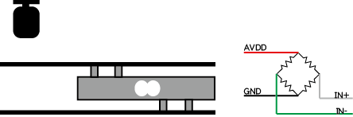
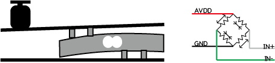
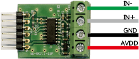
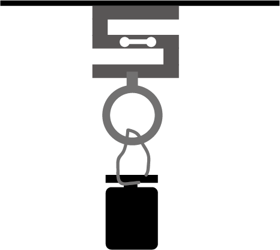
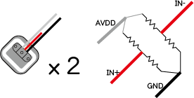
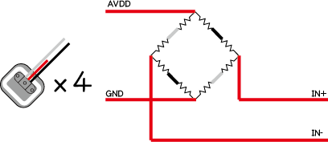
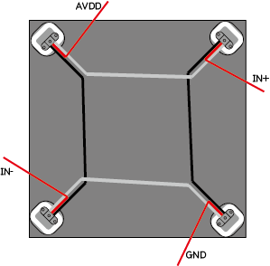
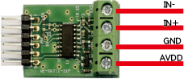
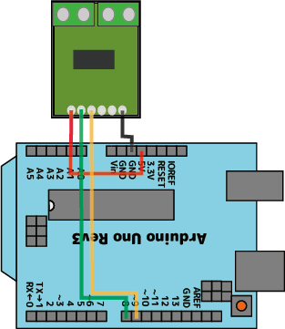

========================================================================
HX711を使った歪ゲージ（ロードセル）計測方法
========================================================================

作成日:2018/03/14

.. image:: 
    :width: 480px

■ 概要
------------------------------------------------------------------------

歪ゲージ（ロードセル）による重量計測をHX711を使い計測します。

ロードセルには幾つか形状の違いによる分類がありますが、原理や回路はほぼ同じです。

https://ja.wikipedia.org/wiki/%E3%83%AD%E3%83%BC%E3%83%89%E3%82%BB%E3%83%AB

個人で購入できるロードセルは秋月電子の物があるので、以下に種類に合わせて分類する。

- ビーム型
    - SC133-20kg        http://akizukidenshi.com/catalog/g/gP-12034/
    - SC616C-500g       http://akizukidenshi.com/catalog/g/gP-12532/
    - SC601-120kg       http://akizukidenshi.com/catalog/g/gP-12035/
    - SC133-10kg        http://akizukidenshi.com/catalog/g/gP-13042/
    - SC133-2kg         http://akizukidenshi.com/catalog/g/gP-13041/

- S字型
    - SC301A-100kg-V50      http://akizukidenshi.com/catalog/g/gP-12036/

- ハーフブリッジ型
    - SC902-200kg       http://akizukidenshi.com/catalog/g/gP-13043/

■ 簡単な原理の説明
------------------------------------------------------------------------

ロードセルの使い方に関しては、以下のサイトがより分かりやすく専門的です。

一読をおすすめいたします。

http://www.m-system.co.jp/mstoday/plan/mame/2018-2019/1801/index.html

http://www.aandd.co.jp/adhome/products/loadcell/introduction/cell_intro01.html

ビーム型ロードセルの使い方
^^^^^^^^^^^^^^^^^^^^^^^^^^^^^^^^^^^^^^^^^^^^^^^^^^^^^^^^^^^^^^^^^^^^

ビーム型ロードセルは、以下の図のように片側は地面に固定し、もう片方を荷台に固定します。

この状態で荷台におもりを載せた際に、ビーム型ロードセルが歪みます。（図のように目で見てわかる歪みはしない）

この際、ロードセルは図の左側の様にブリッジ回路（ホイートストンブリッジ）を形成してあり、
無負荷の際はほぼ中間電圧だが、各抵抗の微小の変化により電圧の変動が発生する。
捕捉として、歪ゲージはフィルム状になったギザギザの抵抗体で、歪みに対して抵抗値が変化する物である。

収縮による抵抗値の変化を利用して、伸びと縮みによる変化をブリッジ回路で検出している。

https://ja.wikipedia.org/wiki/ひずみゲージ

電圧の変動は微弱の為、後段にアンプ回路にて増幅した後にAD変換で計測することが一般的である。

今回使用するHX711はロードセル用に開発されており、ドライブ用電源と基準電源、検出した微弱変化を増幅するアンプ回路、24ビットのAD変換を備えてある。

結線は、HX711のピン名で記述してあるが、以下の図は 秋月電子のAE-HX711 を使用した図です。

Ｓ型ロードセルの使い方
^^^^^^^^^^^^^^^^^^^^^^^^^^^^^^^^^^^^^^^^^^^^^^^^^^^^^^^^^^^^^^^^^^^^

Ｓ字のロードセルは、ロードセル自体は大きくなっているが、その分重たい物が計測できる。

また、ビーム型の様に重さを測る場所と支える場所がズレたりしない為、上に置くだけで測ることができる。

以下の図に１例を載せます。

Ｓ字の上に板を引き（安定しれば無くても良い）その上に測りたいものを載せるだけで重さをはかることができる。

また、以下の様にも使用できる

これは、Ｓ字ロードセルのネジ穴に紐を取り付ける輪っかネジ（リングボルト）を取り付ける事により、引っ張られた重さ（吊り下げた重量）を測ることができる。

これにより、例えば液体やリュックサックの重さなどを気軽に計測することができる。

ハーフブリッジ型ロードセルの使い方
^^^^^^^^^^^^^^^^^^^^^^^^^^^^^^^^^^^^^^^^^^^^^^^^^^^^^^^^^^^^^^^^^^^^

ハーフブリッジ型ロードセルは、ビーム型の様に１箇所で支えるのではなく４箇所（もしくは２箇所）で支える際にブリッジ回路を分散させて計測する際に便利です。

ハーフブリッジ型は名前の通りブリッジ型の半分となり、線は３本となります。

ハーフブリッジ型は一つではブリッジ回路が形成できない為、外部に固定抵抗などを用いて使用しますが、精度が悪く、また荷重範囲がロードセル一つ分の重さまでとなります。

ハーフブリッジ型を２つ使用するとようやくブリッジ回路を形成できるので計測を行うことが出来ます。
支点の数が２つとなりますので、例えば５０Ｋｇのロードセルを２つ使用した際は１００Ｋｇまで計測できるという形です。
（ただしバランスを崩し片方の支点に１００Ｋｇが乗った際に壊れる場合があります）

ハーフブリッジ型を４つ使用した際の結線図です。
２つの際にブリッジ回路が出来ていましたが、４つになると抵抗部分が重なる箇所が出てきます。
この重なった部分は直列の合成抵抗とみなし、抵抗値が２倍のブリッジ回路となります。この辺りの調整は計測時の計算式に影響してきます。
ロードセルを４つ使用するので、支点が４か所となり、例えば１つ５０Ｋｇのロードセルを４箇所で支えれば４倍の２００Ｋｇまで計測を行うことが出来ます。

この方法で、大よそ市販されている電子体重計の仕組みをほぼ同じ構成となります。

この図のように、四隅にハーフブリッジ型ロードセルを置き、
上に最大重荷に耐えられる鉄板などを載せ、均一に重荷が分散されるようにすると体重計のような動作を行う。

AD変換ボードとの結線は、以下の図 秋月電子のAE-HX711 の通り線の色を気にせず信号名を合わせて結線すると通常のロードセルと同じ状態になる。

■ セットアップ
------------------------------------------------------------------------

Arduinoを使用した際
^^^^^^^^^^^^^^^^^^^^^^^^^^^^^^^^^^^^^^^^^^^^^^^^^^^^^^^^^^^^^^^^^^^^^^^^^

:使用したモジュール: URL
:AE-HX711-SIP: http://akizukidenshi.com/catalog/g/gK-12370/
:Arduino Uno Rev3: http://akizukidenshi.com/catalog/g/gM-07385/

以下の図のように結線を行います。

:Arduino側: モジュール側
:+5V: VDD
:D8: DAT
:D9: CLK
:GND: GND

Arduinoのスケッチは以下のリンクより

https://github.com/nonNoise/HX711_SetupMethod/blob/master/example/AE_HX711.ino

::

    //---------------------------------------------------//
    // ロードセル　シングルポイント（ ビーム型）　ＳＣ１３３　２０ｋＧ [P-12034]
    //---------------------------------------------------//
    #define OUT_VOL   0.001f      //定格出力 [V]  Output sensitivity 1.0±0.1mV/V
    #define LOAD      20000.0f    //定格容量 [g]  Capacity 20kg

の箇所を個別で設定します。

秋月電子で販売している商品はコメントを含め記載がありますが、別個購入した物に関してはデーターシートより

Output sensitivity の値をOUT_VOLに、

Capacity  の値を LOADに設定します。

後はAE_HX711_getGramの中でうまい具合に計算が行われます。

::

    void AE_HX711_Init(void);
    void AE_HX711_Reset(void);
    long AE_HX711_Read(void);
    long AE_HX711_Averaging(long adc,char num);
    float AE_HX711_getGram(char num);

    float offset;

    void setup() {
        Serial.begin(9600);
        Serial.println("AE_HX711 test");
        AE_HX711_Init();
        AE_HX711_Reset();
        offset = AE_HX711_getGram(30); 
    }

    void loop() 
    { 
        float data;
        char S1[20];
        char s[20];
        data = AE_HX711_getGram(5);
        sprintf(S1,"%s [g] (0x%4x)",dtostrf((data-offset), 5, 3, s),AE_HX711_Read());
        Serial.println(S1);
    }

■ 奥付
------------------------------------------------------------------------

::
    
    MIT License
    Copyright (c) 2018 Yuta Kitagami  北神雄太  hokusin02@gmail.com
    固有の企業や団体と一切関わりが無い個人のプロジェクトです。
