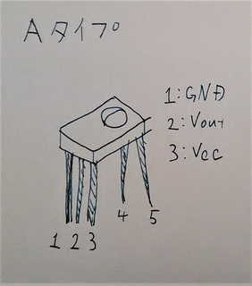
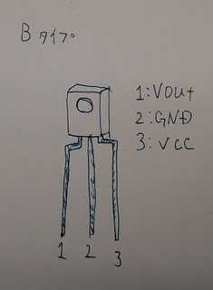
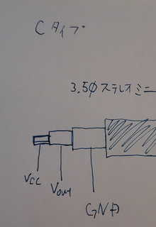
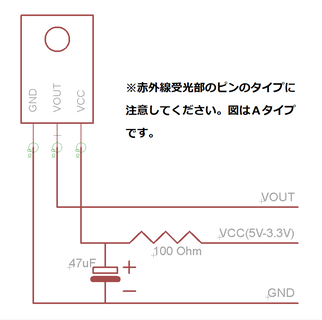

========================================================================
IRリモコンを試してみる
========================================================================

作成日:2018/02/07

.. image:: 
    :width: 480px

■ 概要
------------------------------------------------------------------------

IRリモコンの受信や送信を試してみる

■ 使った部品
------------------------------------------------------------------------

http://akizukidenshi.com/catalog/c/cremocon_ssp/

.. csv-table:: 動作確認表
    :header: "通販番号", "型番", "5V" ,"3.3V" , "Arduino(5V)" , "RaspberryPi" ,"ピン配列"
    :widths: 15, 20, 10, 10, 10, 10, 10
    
    I-00573 , SPS-442-1 , OK , x ,OK , OK(VCC 5V) ,Ａタイプ
    I-00824 , SPS-444-1 , OK , OK ,OK ,OK(VCC 5V) ,Ａタイプ
    I-00585 , SPS-445-1 , OK , OK ,OK , OK(VCC 5V),Ａタイプ
    I-00872 , SPS-448-1 , OK , x ,OK , OK(VCC 5V),Ａタイプ
    I-00614 , SPS-440-1 , OK , OK ,OK , OK(VCC 5V),Ａタイプ
    I-06487 , GP1UXC41QS , OK , OK ,OK , OK ,Ｂタイプ  
    I-01570 , PL-IRM2121-A538 , OK　, x ,OK ,OK(VCC 5V),Ｂタイプ  
    I-04659 , OSRB38C9AA , OK , OK ,OK , OK ,Ｂタイプ
    I-04169 , PL-IRM1261-C438 , OK , OK , OK , OK , Ｂタイプ 
    I-00622 , PL-IRM0101-3 , OK , OK ,OK , OK , Ｂタイプ  
    M-08628 , OSRB38C9BX-W150CM , OK ,OK , OK , OK  , Ｃタイプ 

■ 回路図
------------------------------------------------------------------------

■ サンプルプログラム
------------------------------------------------------------------------

★Arduinoはこちらを参考に試しました。

    http://make.bcde.jp/arduino/%E8%B5%A4%E5%A4%96%E7%B7%9A%E3%83%AA%E3%83%A2%E3%82%B3%E3%83%B3%E3%82%92%E4%BD%9C%E3%82%8B/

★Raspberry Piはこちらを参考に試しました。

    http://blog.bschwind.com/2016/05/29/sending-infrared-commands-from-a-raspberry-pi-without-lirc/

■ 参考資料
------------------------------------------------------------------------

::
    
    MIT License
    Copyright (c) 2018 Yuta KItagami   
    固有の企業や団体と一切関わりが無い個人のプロジェクトです。
