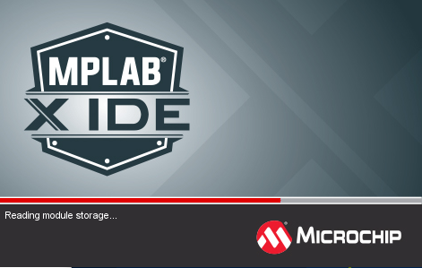

========================================================================
MPLABXを使ったPICマイコン開発方法
========================================================================

作成日:

■ 目次
------------------------------------------------------------------------

■ 概要
------------------------------------------------------------------------
Microchip社のPICマイコンを開発するMPLAB Xの使い方とセットアップ方法

※MPLAB IDEとMPLAB X IDEは別物です。MPLAB Xが最新なので、Ｘがある方について記載します。

■ セットアップ
------------------------------------------------------------------------

1.MPLAB X IDE　ダウンロード
^^^^^^^^^^^^^^^^^^^^^^^^^^^^^^^^^^^^^^^^^^^^^^^^^^^^^^^^^^^^^^^^^^^^^^^^^

http://www.microchip.com/mplab/mplab-x-ide

より、Downloads をクリックし、自身のＯＳに合ったものをダウンロードします。

※びっくりすることに、MPLAB XはWindows以外にもMacOSやLinuxにも対応している為、マルチプラットフォームで開発が出来る

2.MPLAB X IDE　インストール
^^^^^^^^^^^^^^^^^^^^^^^^^^^^^^^^^^^^^^^^^^^^^^^^^^^^^^^^^^^^^^^^^^^^^^^^^

ダウンロード後にダウンロードしたファイルを実行し、インストールを行います。

インストール実行中の画面は以下の通り。特に変更は必要なく、デフォルトの状態でNextをクリックする。

インストール時間は大体２０分程度

3.MPLAB XC コンパイラーのインストール
^^^^^^^^^^^^^^^^^^^^^^^^^^^^^^^^^^^^^^^^^^^^^^^^^^^^^^^^^^^^^^^^^^^^^^^^^

MPLAB X にはコンパイラーが付属していない為（アセンブラはあります。また別会社のコンパイラを使用する事もあり同封されてません)

以下のURLよりMPLAB XCコンパイラをダウロードします。

http://www.microchip.com/mplab/compilers

    ※PICのコンパイラーの種類について
    
    :MPLAB XC8: Microchip社純正の8ビットマイコン(PIC10/12/16/18)用Ｃコンパイラー、無料です。 
    :MPLAB XC16: Microchip社純正の16ビットマイコン(PIC24/dsPIC)用Ｃコンパイラー、無料です。
    :MPLAB XC32: Microchip社純正の32ビットマイコン(PIC32)用Ｃコンパイラー、無料です。
    :MPLAB C: Microchip社純正のCコンパイラ。最適化やハードウェアライブラリがある。有料です。
    :HI-TECH C: HI-TECH社のＣコンパイラ。現在はMicrochip社に買収されXC8で開発できるとか。
    :CCS C: CCS社が提供している有料Ｃコンパイラです。
    :SDCC Small Device C Compiler: オープンソースで作られた無料Ｃコンパイラ。今はメーカー純正のXC8が良いと思われるが好きな方はこちらも使う。

今後のサポートやスペック向上も考え、メーカー純正の無料コンパイラXCシリーズを使用する事をお薦めしています。

また、PICには何種類かのシリーズやビット数があるが、どのPICにも対応出来るように時間はかかるがXC8,XC16,XC32の３種類をダウンロードしておこう。

インストールはダウンロードした物をクリックし、先ほどと同じように変更なしでNextをクリックしていきます。

これで開発環境のセットアップは完了です。

デスクトップに以下のようなアイコンが登場します。

それぞれの機能は

    :MPLAB X IDE: PICの開発やコンパイル、書込みまで行う総合開発環境
    :MPLAB driver switcher: 古い環境から新しい環境へ移行する為のソフト
    :MPLAB IPE: PICへの書き込みや読出しのみを行うライターソフト

となります。

4.MPLAB X IDE の実行
^^^^^^^^^^^^^^^^^^^^^^^^^^^^^^^^^^^^^^^^^^^^^^^^^^^^^^^^^^^^^^^^^^^^^^^^^

MPLAB X IDEを実行して、実際にプロジェクトを作成します。

立ち上がると、以下のような画面になります。

■ コンパイル
------------------------------------------------------------------------

■ 書込み
------------------------------------------------------------------------

■ サンプルプログラム
------------------------------------------------------------------------

■ 参考資料
------------------------------------------------------------------------

::
    
    MIT License
    Copyright (c) 2018 Yuta KItagami   
    固有の企業や団体と一切関わりが無い個人のプロジェクトです。
