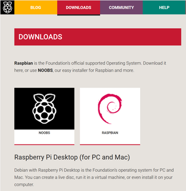
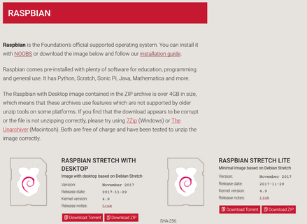
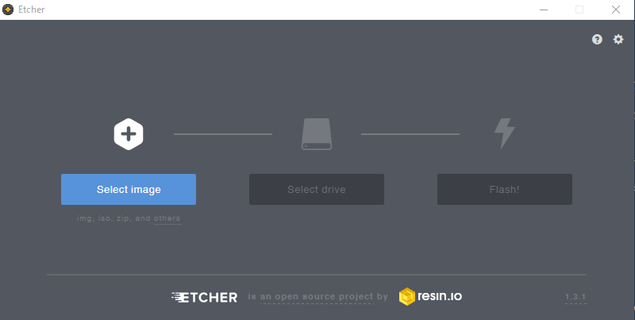
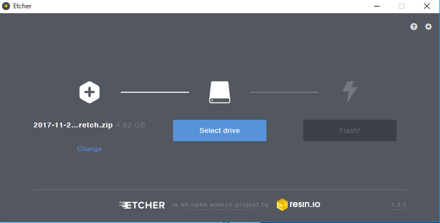
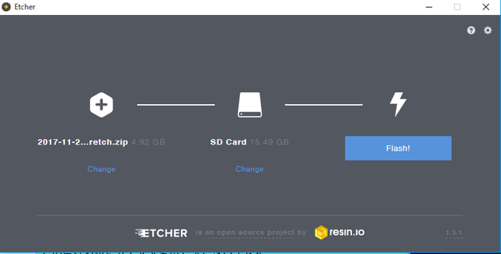
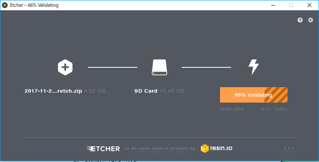
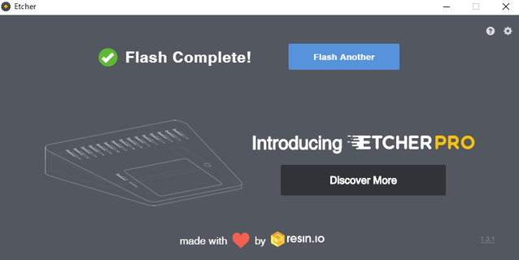

=====================================================================
RaspberryPiをセットアップする方法　2018年版
=====================================================================

最終更新日: 2018/02

毎年毎年新しいＯＳや新しい機種が出る為、なるべく新しい情報を伝えるべく2018年版を作りました。

■　本資料で対応するRaspberryPi
--------------------------------------------------------------------

-   Raspberry Pi A+

-   Raspberry Pi B+

-   Raspberry Pi 2B

-   Raspberry Pi 3B

-   Raspberry Pi Zero

-   Raspberry Pi Zero W

-   Raspberry Pi Zero WH

■　RaspberryPi用のOSをタウンロード
--------------------------------------------------------------------

以下のURLよりOSをダウンロードしていきます。

    https://www.raspberrypi.org/downloads/ 

NOOBS ではなく　Raspbian  を選択します。

NOOBS は、Rasbian以外のＯＳも含めて **簡単にインストール** を行う為のＯＳですが、
OSをインストール後にファイルやドライバ、configファイル等に問題が起きやすく、
それらの問題を解決する方法が **簡単ではありません**
成るべく、Raspbian をインストールすることをおすすめいたします。

Raspbian Stretch with desktop をダウンロード（Download ZIPをクリック）します。

::
    
    Raspbian Stretch with desktop
    Image with desktop based on Debian Stretch
    Version: November 2017
    Release date: 2017-11-29
    Kernel version: 4.9
    Release notes: Link

Raspbian Stretch Liteの方は、コマンドラインだけが立ち上がる軽量ＯＳです。

続いて、SDカードにＯＳを書込む為のソフトウェアをインストールします。

■　Etcher を使ってSDカードにOSを書込む
-------------------------------------------------------------------

Etcherは各OS(Windows,Mac,Linux)で動作するOSを書込む為のソフトウェアです。

    https://etcher.io/

自分に合わせたＯＳ選択し、ダウンロードします。

インストール後にEtcherを起動します。

以下の様な画面が出ますので 「Select image」をクリックし、先ほどダウンロードしたRasbianのOSを選択します。

続いて「Select drive」を選択します。そこでどのドライブにしますか？と聞かれますので、ＳＤカードを選択します。

すると、以下のような状態になり、再度確認を行い、問題が無いようでしたら「Flash!」をクリックします。

以下のように進捗バーが進み、うまく行くと終了と図のようになります。

終了後、SDを抜き、RaspberryPiに接続します。

■　SDカードを書込んだ後のセットアップ方法
-------------------------------------------------------------------

SDカードを書込んだ後、どのように使うかによってセットアップ方法が変わります。

大よそ、以下のような使い方が見受けられます。

HDMIに画面出力して使用する方法
^^^^^^^^^^^^^^^^^^^^^^^^^^^^^^^^^^^^^^^^^^^^^^^^^^^^^^^^^^^^^^^^^^^^

    https://github.com/nonNoise/Kitagami-KnowledgeBase/blob/master/RaspberryPi/01.rst

HDMIもWiFiも使わずシリアル通信よりアクセスする方法
^^^^^^^^^^^^^^^^^^^^^^^^^^^^^^^^^^^^^^^^^^^^^^^^^^^^^^^^^^^^^^^^^^^^

    https://github.com/nonNoise/Kitagami-KnowledgeBase/blob/master/RaspberryPi/02.rst

HDMIに画面出力せず、SSHでWiFiよりVPN(もしくはターミナル)でアクセスする
^^^^^^^^^^^^^^^^^^^^^^^^^^^^^^^^^^^^^^^^^^^^^^^^^^^^^^^^^^^^^^^^^^^^

[RaspberryPi Zero限定]　USB-OTGを用いてPCよりアクセスする
^^^^^^^^^^^^^^^^^^^^^^^^^^^^^^^^^^^^^^^^^^^^^^^^^^^^^^^^^^^^^^^^^^^^

