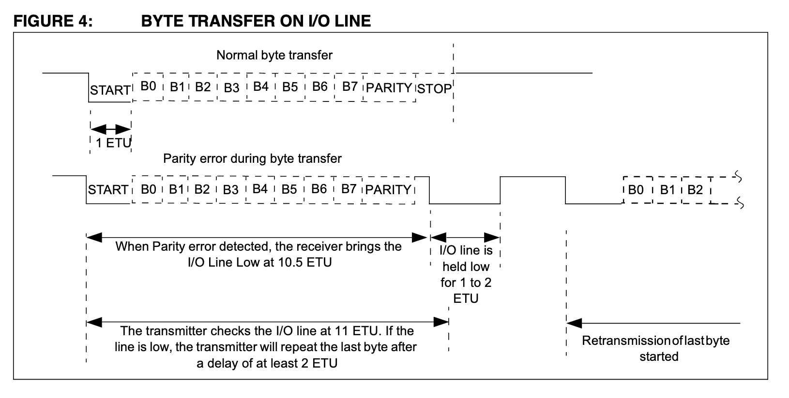
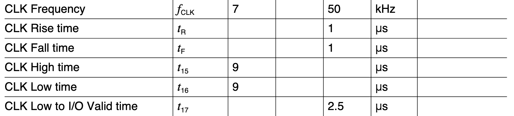
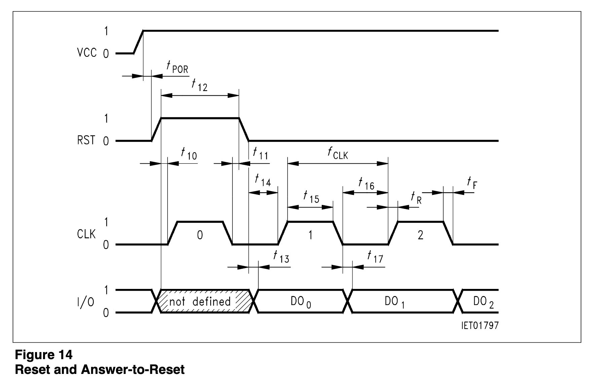

====================================================================================
SIMカードをマイコンで読み出す方法
====================================================================================

■ はじめに
------------------------------------------------------------------------------------
SIMの中身が見てみたい。なんとなく。

■マイコン部
------------------------------------------------------------------------------------

クロックとIOの半二乗通信（らしい）

ほとんどの例は、クロック付きのシリアル通信を応用して読み出している（らしい）

I2CやSDカードとは別物だった。

リセット時にクロックだけ与えると、カードの初期情報が取得できる（らしい）

電源は5V,3V,1.8Vの三種類ある（らしいが、機器によって範囲がかわるかも）

ISOとJISで規格化されている

携帯用のSIMカードの他に、クレジットカードでも読み出す事ができる（らしい）

メモリー内はフォルダーの概念があり、フォルダーを選択して中のファイルをみに行く感じ（らしい）

SIMの端子は６ピン

:VCC: 電源端子（5V~1.8V)
:RST: リセット端子
:CLK: クロック端子
:GND: 電源グランド
:VPP: 書き込み時に供給する電圧端子（現在は未使用ピン）
:I/O: クロックに同期して送信、受信データ通信を行う

タイミングチャートは以下の通り

スタートビットとストップビットがあり、パリティチェックもある。

どうも、UARTのようにも思えるが、これにクロックが一緒についてくる。

クロックの速度は

のように、7KHzから50KHzとまぁまぁ低速である。

よくあるシリアル通信は、 9.6Kbps(9600bps)がちょうど良さそう。

■ ATRコマンド
------------------------------------------------------------------------------------

リセットを送った後にクロックが入るとATRコマンドを発行する（らしい）

その受け取り結果で、カードが持つ情報や通信方式がわかる（らしい）

https://smartcard-atr.appspot.com/parse?ATR=3B021450

タイミングチャートは以下の通り

動くかな。

::
    
    MIT License
    Copyright (c) 2018 Yuta KItagami   
    固有の企業や団体と一切関わりが無い個人のプロジェクトです。
