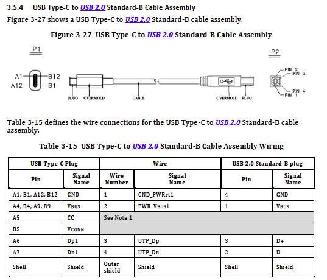
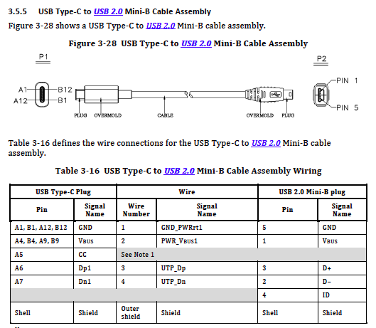
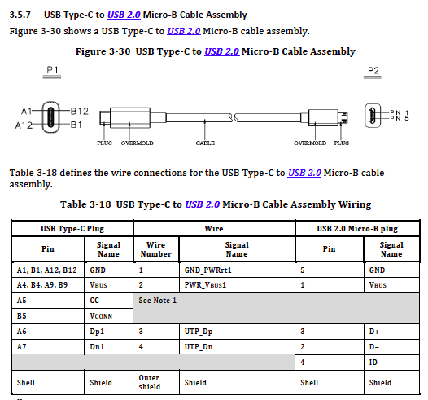
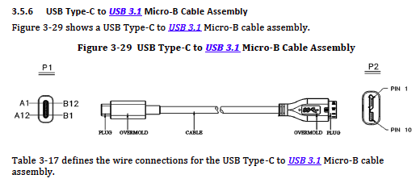
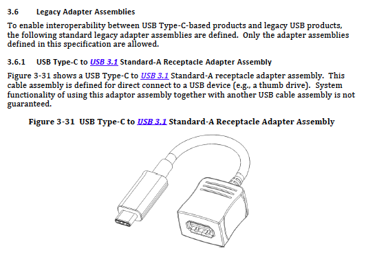
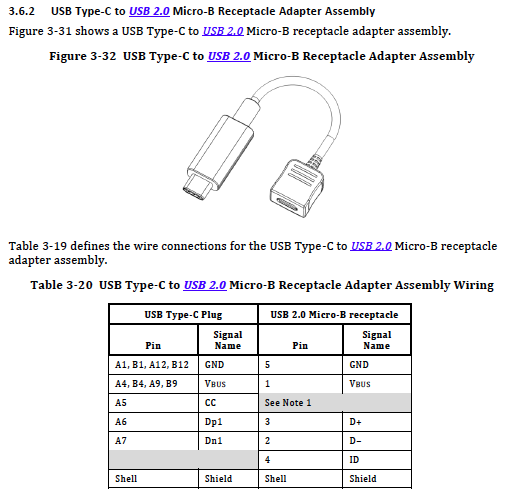
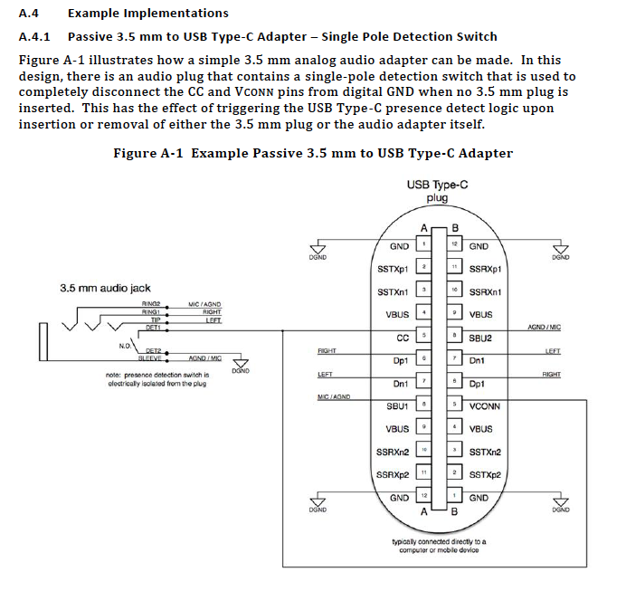

==============================================================
USBの規格で認められた　Type-C 変換アダプタについて
==============================================================

参照元（ソース）
-------------------------------------------------------------
https://github.com/nonNoise/Kitagami-KnowledgeBase/blob/master/USB_Type-C/USB%20Type-C%20Specification%20Release%201.3.pdf

USB Type-C Specification Release 1.3.pdf

● TypeC to Type-B ケーブル

● TypeC to Type-B(Mini-B) ケーブル

● TypeC to Type-B(Micro-B) ケーブル

● TypeC to Type-B(Micro-B USB 3.0) ケーブル

● TypeC to Type-A アダプタ

● TypeC to Micro-B アダプタ

● TypeC to 3.5mmAudioJack　（対応した機種ある？）

