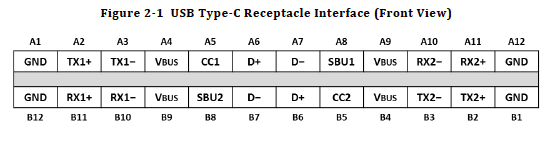
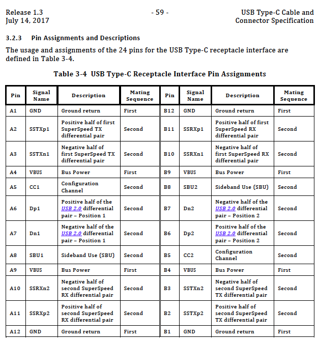
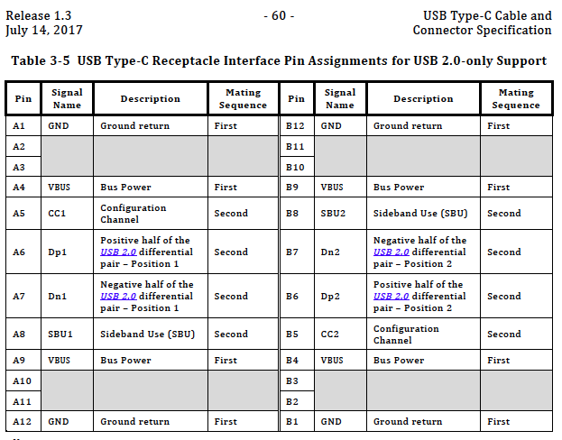
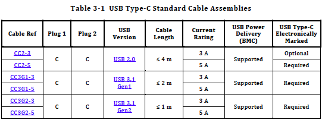
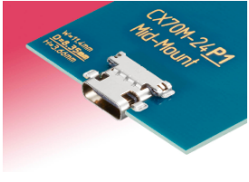
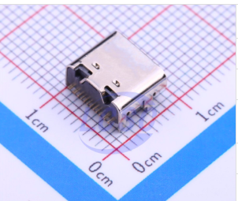
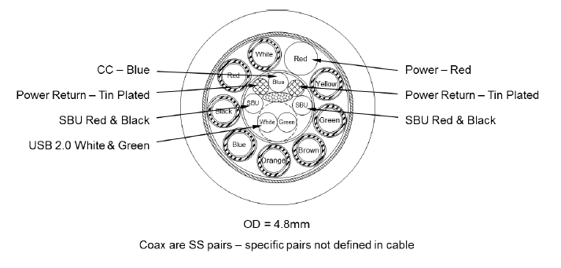
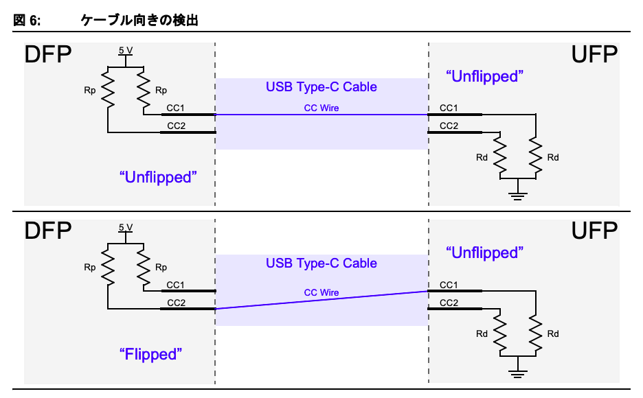
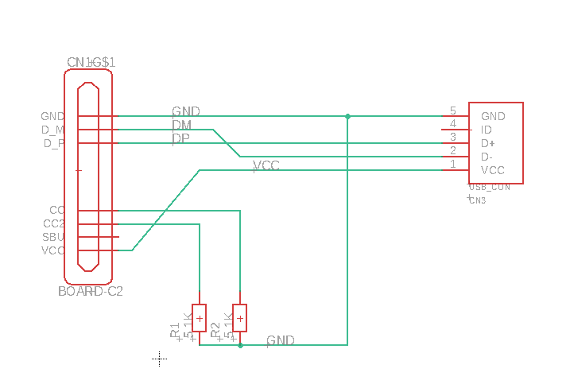

==============================================================
USB2.0スレーブ機器を開発するときのノウハウ
==============================================================

■ Type-Cのピンアサイン
--------------------------------------------------------------

● Type-C フル機能での端子表

● Type-C USB2.0での端子表

■ Type-Cで使用できるケーブル長さ
--------------------------------------------------------------

■ Type-C to USB2.0コネクタは合法的なコネクタである。（規格にあった）
--------------------------------------------------------------

.. image:: ./img/TypeCtoUSB20.png
    :width: 480px

■ よく使うコネクタ
--------------------------------------------------------------

● ヒロセ電機　Type-C コネクタ　CX70M-24P1

http://akizukidenshi.com/catalog/g/gC-13235/

USB2.0と3.1のフル対応した24ピン端子

基板に切り込みが必要だったり、SMDとPINがついた変態コネクタ

実装が難しそうだが基板を上手く作ると手付けも可能。（著者談)

● ヒロセ電機　Type-C コネクタ　CX90M-16P

USB2.0のみに対応した16ピン端子

販売店見当たらず。安かったら欲しい。

● Korean Hroparts Elec TYPE-C-31-M-12

https://lcsc.com/product-detail/USB-Type-C_Korean-Hroparts-Elec-TYPE-C-31-M-12_C165948.html

Korean Hroparts Elec社が作っているType-C から USB2.0の端子だけ出力するコネクタ。

基板上に実装するタイプだが、安くてスリムでピンも広く使い勝手が良さそう。

■ USB2.0として使うためのピン配線
--------------------------------------------------------------

Type-Cのコネクタには TX1 TX2などのように、同じ名称で1と2があることがある。これは、Type-Cが両側に同じ端子が並んでいる為に別れていると思われる。

しかし、詳しく調べていくうちに、特定のピンは確かに上下同じ動作をするが、他のピンは接続された方向を認識してチップで反転させたりしているようだ。

USB 2.0で使用する際は、特に気にしなくて良いが、USB 3.0やホストを作る際は意識した方が良い。

.. image:: ./img/TypeC-CC1CC2.png
    :width: 480px

これが標準的な結線である。USB 2.0が使用する D+/D-は①②共に結線されて繋がっているが、USB 3.0で使用するSSTX SSRXは①と②が別々に接続れている。

また、CCについてもCC1とCC2が別々の接続先に繋がっている。

CCについては後述の項目で説明するが、USB 2.0スレーブ機器を開発する際は、CC1とCC2をプルダウンして5V@1A程度供給してもらうことができる。

■ CC端子について
--------------------------------------------------------------

Type-Cの規格書を読むにつれて、CC1とCC2の扱い方に混乱を覚えたので上手く解釈する。

CC1とCC2はそれぞれ別に端子であり、真理値表があることがわかった。

.. image:: ./img/CC1CC2.png
    :width: 480px

しかし、ケーブルを見ていただけると、CCという線が１本しかなく、CC1,2の線が無い。

CCの大きな用途としては、ホストかスレーブかを調べるだけでなく、方向検知を行う部分もあり、

ケーブルはCC１本でありそれがCC1もしくはCC2に接続された際に上向きなのか下向きなのかを検出できる。

http://ww1.microchip.com/downloads/jp/AppNotes/00001953A_JP.pdf

その為、規格書に書かれたに書かれた[CC1 Rd/CC2 Open]や[CC1 Open/CC2 Rd]は、ケーブル内にCCが一本しか無い為、
CC1とCC2共にRd(プルダウン)することで、どちらか一方は必然的にOpenとなる。

しかし、表にはCC1とCC2がプルダウンした際の動作「Debug Accessory Mode attached」が存在する。
これはきっと、特殊なケーブルや特殊な治具によって機器のデバックを行う事を想定しての状態だろう。
標準的に販売されているケーブルはCCは一本である。

■ USB2.0として使うための回路設計
--------------------------------------------------------------

.. image:: ./img/TypeCtoUSB2.png
    :width: 480px

基本的には、Type-C to Micro-B のケーブル変換の内容を見れば、ピンの配置などがわかるが、注意書きがあるので以下にGoogle翻訳したものを載せる。

    1. USB Type-CプラグのCC1,CC2ピンは抵抗Rd（5.1kΩ±20％）を介してGNDに接続します。

       Rdの機能説明と値については、4.5.3.2.1項および表4-21を参照してください。

CC端子は、Type-Cがホスト（Source、DFP : Downstream Facing Port）なのかスレーブ(Sink,UFP : Upstream Facing Port )なのかを検知したりします。

USB 2.0スレーブとして動かすには、このCC端子（CC1とCC2共に）【 5.1kΩ±20％ 】をGNDに対してプルダウンすれば良いという事になる。

.. image:: ./img/TypeCtoCC.png
    :width: 480px

■ 電源について
--------------------------------------------------------------

Type-Cは最大20Vまで電源を出力できるが、それはUSB PDとして動作した際である。

20Vを出力する際は、CC端子にパルス通信を行い、お互い機器が対応しているかを問い合わせてから出力される。

その為、最初に接続した際はCC端子がプルアップかプルダウンかを確認しにいく。

もしプルダウンであれば、スレーブ機器として認識し、ひとまず5V@500mAを流してくれます。

ここで、マスター側に十分な電力供給ができる状態であれば、5V@1.5Aまで使用することが可能である。

ただし問題もある。今までUSBホストには電流制限用のポリスイッチが入っていたが、今回電流を多く供給する為に、スレーブ側で電流制限をしっかり設けなければ成らない。

設計する機器に合わせてポリスイッチを入れることをオススメします。（まだType-Cが使える機器は高いのでね）

■ USB2.0として使うための参考回路
--------------------------------------------------------------

以上の注意点を考慮すると、以下のような回路図となる。

SBU端子については未接続でOK。この端子はどうもAudioとして使用する際のアナロググランドになる予定の端子らしい。

