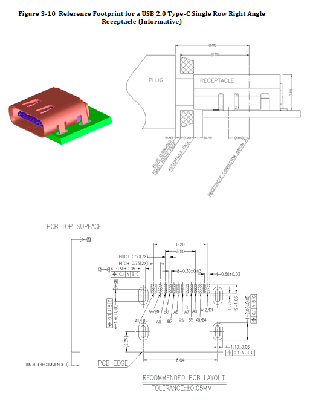
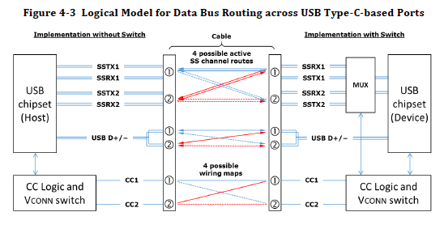
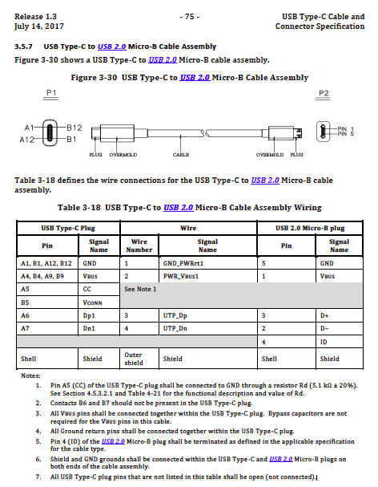
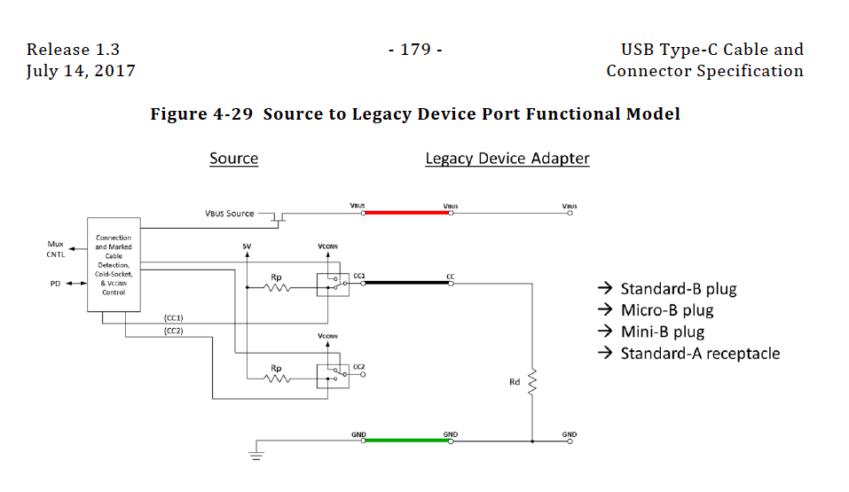
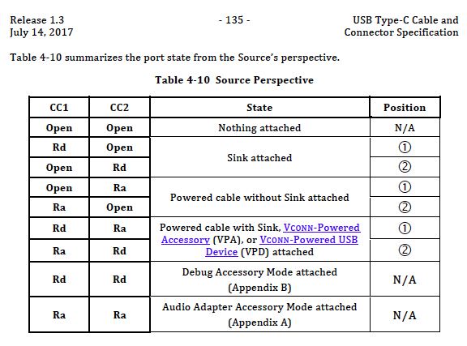

==============================================================
USB2.0スレーブ機器を開発するときのノウハウ
==============================================================

■ Type-C to USB2.0コネクタは合法的なコネクタである。（規格にあった）
--------------------------------------------------------------

■ よく使うコネクタ
--------------------------------------------------------------

● ヒロセ電機　Type-C コネクタ　CX70M-24P1

http://akizukidenshi.com/catalog/g/gC-13235/

USB2.0と3.1のフル対応した24ピン端子

基板に切り込みが必要だったり、SMDとPINがついた変態コネクタ

実装が難しそうだが基板を上手く作ると手付けも可能。（著者談)

● ヒロセ電機　Type-C コネクタ　CX90M-16P

USB2.0のみに対応した16ピン端子

販売店見当たらず。安かったら欲しい。

● Korean Hroparts Elec TYPE-C-31-M-12

https://lcsc.com/product-detail/USB-Type-C_Korean-Hroparts-Elec-TYPE-C-31-M-12_C165948.html

Korean Hroparts Elec社が作っているType-C から USB2.0の端子だけ出力するコネクタ。

基板上に実装するタイプだが、安くてスリムでピンも広く使い勝手が良さそう。

■ USB2.0として使うためのピン配線
--------------------------------------------------------------

Type-Cのコネクタには TX1 TX2などのように、同じ名称で1と2があることがある。これは、Type-Cが両側に同じ端子が並んでいる為に別れていると思われる。

しかし、詳しく調べていくうちに、特定のピンは確かに上下同じ動作をするが、他のピンは接続された方向を認識してチップで反転させたりしているようだ。

USB 2.0で使用する際は、特に気にしなくて良いが、USB 3.0やホストを作る際は意識した方が良い。

参考の結線図があった為、載せておく。

これが標準的な結線である。USB 2.0が使用する D+/D-は①②共に結線されて繋がっているが、USB 3.0で使用するSSTX SSRXは①と②が別々に接続れている。

また、CCについてもCC1とCC2が別々の接続先に繋がっている。

CCについては以下の項目で記述するが、USB 2.0スレーブとして設計する際は、CC1だけプルダウンする。

■ USB2.0として使うための回路設計
--------------------------------------------------------------

基本的には、Type-C to Micro-B のケーブル変換の内容を見れば、ピンの配置などがわかるが、注意書きがあるので以下にGoogle翻訳したものを載せる。

    1. USB Type-CプラグのA5（CC）ピンは抵抗Rd（5.1kΩ±20％）を介してGNDに接続します。
    
    Rdの機能説明と値については、4.5.3.2.1項および表4-21を参照してください。

CC端子は、Type-Cがホスト（Source、DFP : Downstream Facing Port）なのかスレーブ(Sink,UFP : Upstream Facing Port )なのかを検知したりします。

USB 2.0スレーブとして動かすには、このCC端子に**5.1kΩ±20％**をGNDに対してプルダウンすれば良いという事になる。

最初著者は、CC1とCC2が同じ端子かと思ったが、実はCC1とCC2はそれぞれ別に端子であり、真理値表があることがわかった。

もし、端子にCC1,CC2がある際は、CC1にのみプルダウン抵抗をGNDに接続することをオススメする。

（もし誤ってCC1,CC2両方に取り付けてしまったら、表よりDebugモードとして認識されるが、これは他のピンとの複合なので、通常のスレーブ機器として認識される事もある）

また、CC1,CC2に抵抗を接続しなかった場合は、Type-Cの機器では電源供給すら行われない場合がある。その際は、5.1KΩがケーブル内部で接続されたものを使用するか、

